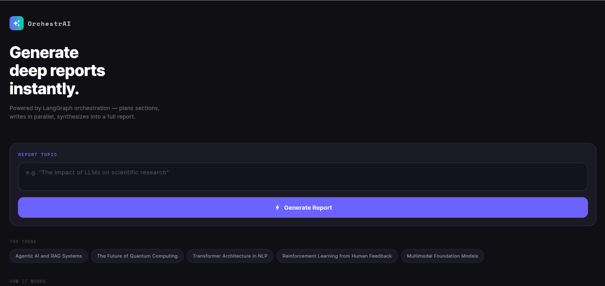
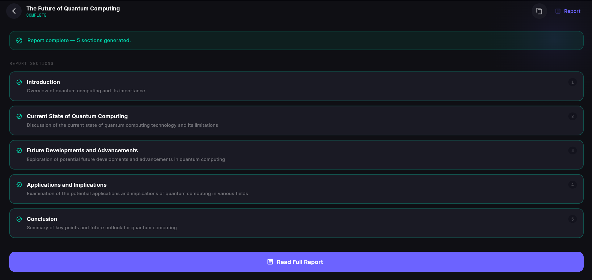
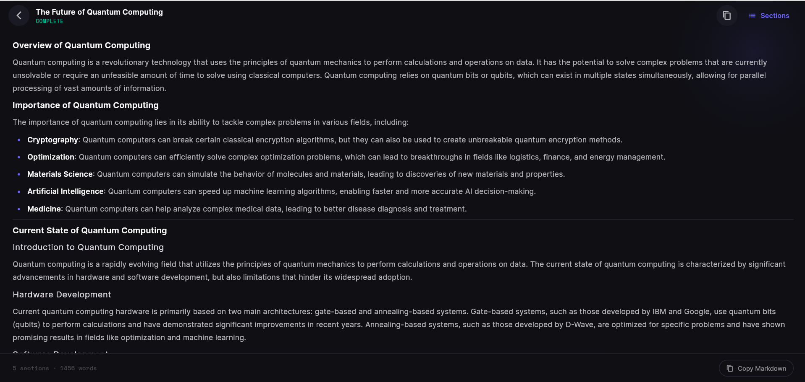
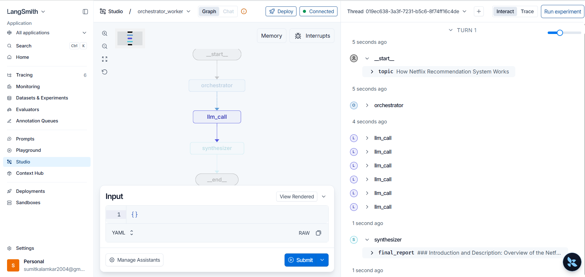
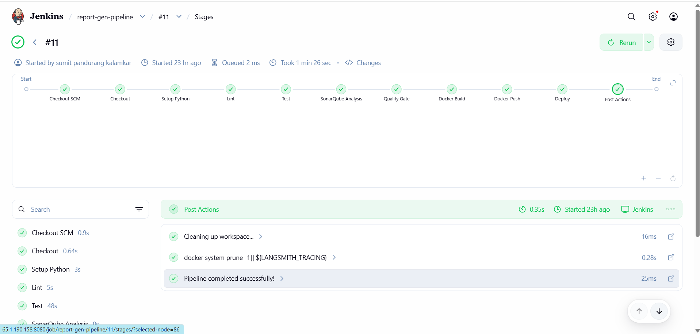
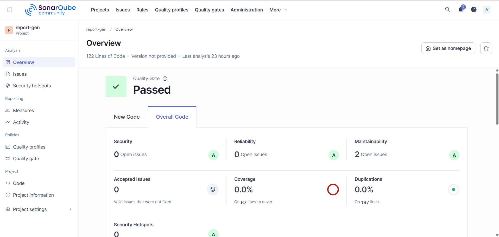

<div align="center">


# OrchestrAI — AI-Powered Report Generator

**A production-grade AI report generation system powered by LangGraph Orchestrator-Worker architecture, deployed on AWS with a full CI/CD pipeline.**

[](https://python.org)
[](https://fastapi.tiangolo.com)
[](https://flutter.dev)
[](https://langchain.com)
[](https://docker.com)
[](https://jenkins.io)
[](https://sonarqube.org)
[](https://aws.amazon.com)
[](LICENSE)

[Live Demo](#live-demo) • [Architecture](#architecture) • [Setup](#setup) • [CI/CD Pipeline](#cicd-pipeline) • [API Docs](#api-endpoints)

</div>

---

## Overview

OrchestrAI is a full-stack AI application that generates deep, structured reports on any topic using a **LangGraph Orchestrator-Worker pattern**. The orchestrator plans report sections, parallel workers write each section simultaneously, and a synthesizer combines them into a final cohesive report.

---

## Architecture

```
┌─────────────────────────────────────────────────────────────────────┐
│                        CLIENT LAYER                                  │
│                                                                      │
│   ┌──────────────────────────────────────┐                          │
│   │     Flutter Web (AWS EC2 + Nginx)    │                          │
│   │     Dark themed SPA                  │                          │
│   └──────────────┬───────────────────────┘                          │
└──────────────────┼──────────────────────────────────────────────────┘
                   │ HTTP REST
┌──────────────────▼──────────────────────────────────────────────────┐
│                        API LAYER                                     │
│                                                                      │
│   ┌──────────────────────────────────────┐                          │
│   │     FastAPI Backend (Docker)         │                          │
│   │     POST /plan-sections              │                          │
│   │     POST /generate-report            │                          │
│   │     GET  /health                     │                          │
│   └──────────────┬───────────────────────┘                          │
└──────────────────┼──────────────────────────────────────────────────┘
                   │
┌──────────────────▼──────────────────────────────────────────────────┐
│                     LANGGRAPH LAYER                                  │
│                                                                      │
│   ┌─────────────┐     ┌──────────────────────────────┐              │
│   │ Orchestrator│────▶│  Worker 1  │  Worker 2  │ .. │              │
│   │  (Planner)  │     │  Section 1 │  Section 2 │ .. │              │
│   └─────────────┘     └──────────────┬───────────────┘              │
│                                      │                               │
│                        ┌─────────────▼──────────┐                   │
│                        │      Synthesizer        │                   │
│                        │   (Final Report)        │                   │
│                        └────────────────────────┘                   │
└─────────────────────────────────────────────────────────────────────┘
                   │
┌──────────────────▼──────────────────────────────────────────────────┐
│                      LLM LAYER                                       │
│                                                                      │
│         Groq API (llama-3.3-70b-versatile)                          │
│         LangSmith Tracing & Monitoring                               │
└─────────────────────────────────────────────────────────────────────┘
```

---

## CI/CD Pipeline

```
Developer Push
      │
      ▼
┌─────────────┐
│   GitHub    │ ──── Webhook ────▶ ┌─────────────────────────────────┐
│    Repo     │                    │         Jenkins Pipeline         │
└─────────────┘                    │                                  │
                                   │  1. Checkout SCM                 │
                                   │  2. Setup Python 3.11            │
                                   │  3. Lint (pylint score > 7.0)    │
                                   │  4. Test (73 tests, 100% cov)    │
                                   │  5. SonarQube Analysis           │
                                   │  6. Quality Gate Check           │
                                   │  7. Docker Build & Push          │
                                   │  8. Deploy to EC2                │
                                   └──────────────┬──────────────────┘
                                                  │
                              ┌───────────────────┼───────────────────┐
                              ▼                   ▼                   ▼
                       ┌────────────┐    ┌──────────────┐    ┌──────────────┐
                       │ SonarQube  │    │  DockerHub   │    │  AWS EC2     │
                       │  Quality   │    │   Registry   │    │  Deployment  │
                       │   Gate     │    │              │    │              │
                       └────────────┘    └──────────────┘    └──────────────┘
```

---

## Screenshots

> **Flutter UI — Home Screen**

<!-- Add screenshot here -->


> **Flutter UI — Report Generation Progress**

<!-- Add screenshot here -->


> **Flutter UI — Generated Report**

<!-- Add screenshot here -->


> **LangGraph Studio — Graph Visualization**

<!-- Add screenshot here -->


> **Jenkins CI/CD Pipeline — Build #11 (All Stages Passed)**

<!-- Add screenshot here -->


> **SonarQube — Quality Gate Passed**

<!-- Add screenshot here -->


---

## Project Structure

```
orchestration.ai/
├── lib/                           # Flutter frontend
│   ├── main.dart                  # App entry, dark theme
│   ├── models/
│   │   └── report_model.dart      # Data models & state enums
│   ├── services/
│   │   └── report_service.dart    # HTTP client for backend
│   └── screens/
│       ├── home_screen.dart       # Topic input + suggestions
│       └── report_screen.dart     # Live progress + report viewer
├── tests/                         # Production-level test suite
│   ├── conftest.py                # Shared fixtures, all LLM calls mocked
│   ├── test_health.py             # Health endpoint tests
│   ├── test_plan_sections.py      # Plan sections endpoint tests
│   ├── test_generate_report.py    # Generate report endpoint tests
│   ├── test_graph.py              # LangGraph node unit tests
│   ├── test_models.py             # Pydantic model validation tests
│   └── test_cors.py               # CORS middleware tests
├── graph.py                       # LangGraph orchestrator-worker graph
├── backend.py                     # FastAPI backend
├── Dockerfile                     # Docker container config
├── docker-compose.yml             # Jenkins + SonarQube + App
├── Jenkinsfile                    # CI/CD pipeline definition
├── sonar-project.properties       # SonarQube config
├── pyproject.toml                 # Python project config
├── requirements.txt               # Python dependencies
├── langgraph.json                 # LangGraph Studio config
└── pubspec.yaml                   # Flutter dependencies
```

---

## Tech Stack

| Layer | Technology |
|---|---|
| Frontend | Flutter Web, Dart, flutter_markdown, google_fonts |
| Backend | FastAPI, Python 3.11, Pydantic v2 |
| AI/ML | LangGraph, LangChain, Groq (llama-3.3-70b) |
| Observability | LangSmith tracing, SonarQube quality gate |
| Containerization | Docker, Docker Compose |
| CI/CD | Jenkins Pipeline, GitHub Webhooks |
| Cloud | AWS EC2 (t2.large), AWS S3, AWS CloudFront, Elastic IP |
| Testing | pytest, pytest-cov (100% coverage, 73 tests) |

---

## Setup

### Prerequisites
- Python 3.11
- Flutter SDK
- Docker & Docker Compose
- Groq API key ([console.groq.com](https://console.groq.com))
- LangSmith API key ([smith.langchain.com](https://smith.langchain.com))

### 1. Clone the repo
```bash
git clone https://github.com/Sumitkalamkar/orchestration.ai.git
cd orchestration.ai
```

### 2. Configure environment
```bash
cp .env.example .env
```

Edit `.env`:
```env
GROQ_API_KEY=your_groq_key_here
LANGSMITH_TRACING=true
LANGSMITH_ENDPOINT=https://api.smith.langchain.com
LANGSMITH_API_KEY=your_langsmith_key_here
LANGSMITH_PROJECT=report-gen
```

### 3. Backend
```bash
python3.11 -m venv venv
source venv/bin/activate        # Windows: venv\Scripts\activate
pip install -r requirements.txt
uvicorn backend:app --reload --port 8000
```

### 4. Flutter App
```bash
flutter pub get
flutter run -d chrome
```

> For Android emulator change `baseUrl` in `lib/services/report_service.dart`:
> `http://localhost:8000` → `http://10.0.2.2:8000`

### 5. LangGraph Studio
```bash
pip install "langgraph-cli[inmem]"
langgraph dev
```
Opens at `http://localhost:8123`

---

## API Endpoints

| Method | Endpoint | Description |
|---|---|---|
| `GET` | `/health` | Health check |
| `POST` | `/plan-sections` | Plan report sections (orchestrator only) |
| `POST` | `/generate-report` | Full report generation (orchestrator + workers + synthesizer) |

### Example Request
```bash
curl -X POST http://localhost:8000/generate-report \
  -H "Content-Type: application/json" \
  -d '{"topic": "Retrieval Augmented Generation in Large Language Models"}'
```

### Example Response
```json
{
  "topic": "Retrieval Augmented Generation in Large Language Models",
  "sections": [
    {"name": "Introduction", "description": "Overview of RAG systems"},
    {"name": "Architecture", "description": "Technical components"}
  ],
  "final_report": "## Introduction\n\nRAG systems combine..."
}
```

---

## Testing

```bash
# Run all tests
pytest tests/ -v

# Run with coverage
pytest tests/ -v --cov=. --cov-report=term-missing
```

**Test Results:**
```
73 tests collected
✅ 67 passed
Coverage: 100%
```

---

## Deployment

### Infrastructure
```
AWS EC2 (t2.large, Amazon Linux 2023)
├── :80   → Flutter Web (Nginx)
├── :8000 → FastAPI Backend (Docker)
├── :8080 → Jenkins CI/CD
└── :9000 → SonarQube Code Quality
```

### Deploy with Docker
```bash
docker-compose up -d
```

### Jenkins Pipeline Stages
1. **Checkout** — Pull from GitHub
2. **Setup Python** — Create venv, install dependencies
3. **Lint** — pylint score must be > 7.0
4. **Test** — 73 tests, 100% coverage required
5. **SonarQube Analysis** — Static code analysis
6. **Quality Gate** — Must pass before proceeding
7. **Docker Build** — Build and tag image
8. **Docker Push** — Push to DockerHub registry
9. **Deploy** — Run container on EC2

---

## Author

**Sumit Kalamkar**

[](https://github.com/Sumitkalamkar)
[](https://linkedin.com/in/sumit-kalamkar)
[](https://huggingface.co/sumitkalamkar)

---

<div align="center">

**If you found this project useful, please consider giving it a ⭐**

</div>
